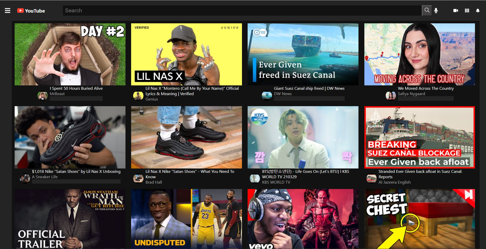
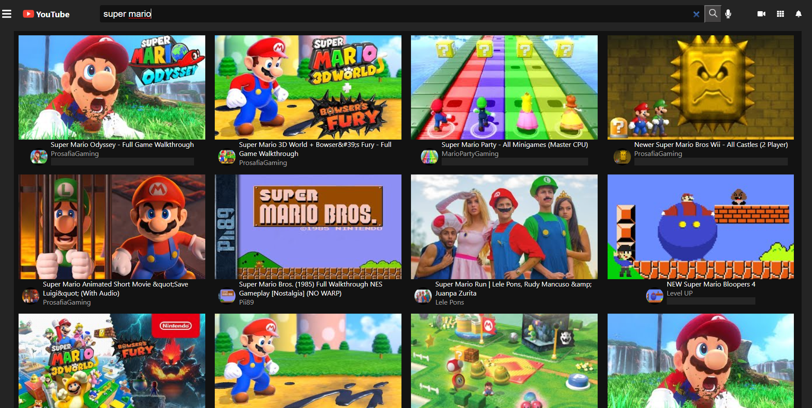
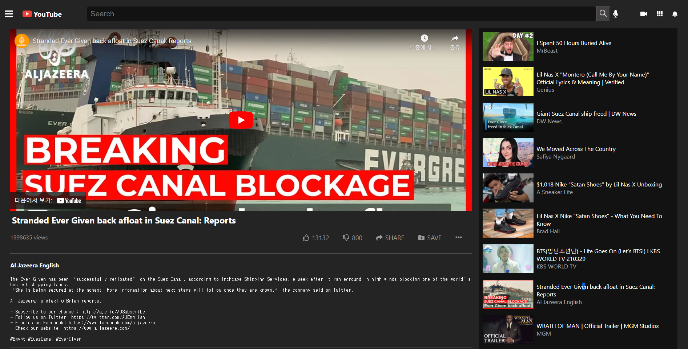

# Youetube Clone

Youtube clone with React

Try to make a simple youtube page using Youtube API.

- Default page - Search bar + List of most popular videos
- Play page - Page of clicked video(youtube) + Information of video + list of most popular videos
- Search result - Search bar + List of video

Outline</summar>

1. About the project
2. Process
3. Structure
4. Problem and solving
5. What I learn
6. Reference

1. About the project

   ✅ Simply clone the youtube website and materialization some function.

   ✅ Using youtube API

2. Process

   - Fetch the youtube api and bring most popular videos.
   - Make a search-bar to search videos through youtube API.
   - Go to the video details and play videos when clicked.

3. Structure

| Page         | Description                                                                         |
| ------------ | ----------------------------------------------------------------------------------- |
| Default Page |  Most popular video web page |
| Search       |  Search page                      |
| Search       |  Video selected                   |

4. Problem and solving

   ❗ I can't get statistics information when I get youtube-search API

   ➡ Try to get channel Id and fetch the api one more time?

   ❗ There are some weird blank background on the default page

5. What I learn

   1. The way using youtube API.
   2. Differnet between Fetch and Axios.
   3. Function component in React.
   4. React - hide the key.
   5. Seperate network from components.
   6. Quota exceed situation

6. Reference
   1. dream-coding
   2. React official website
